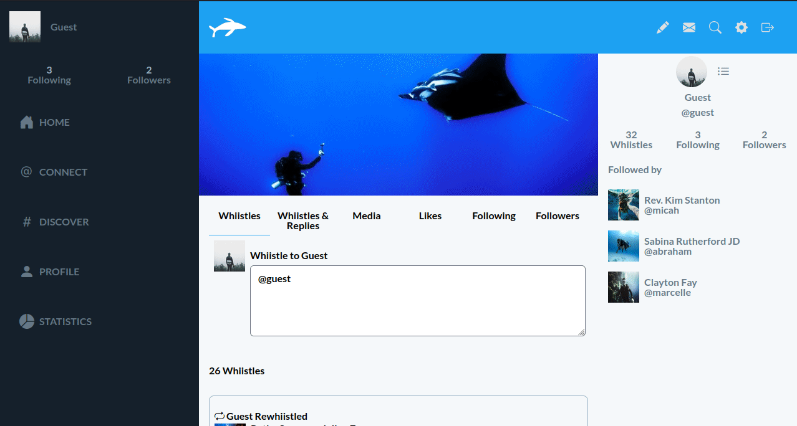

# Whistle 

> Whistle!

## Description

In this project, a website similar to twitter is built. This website is for people interesting in diving.

Project name is referring to a way of communication of whales called as whistle. Posts in this project are called as 'whiistle' to make them similar 'tweet'.

## Features

The following features are available;

- Follow a user

- Whiistle something
- Like a whiistle
- Reply a whiistle
- Reshare a whiistle
- Add images to whiistles
- Add quoted whiistles to whiistles/replies

## Built with

- Ruby
- Ruby on Rails
- HotWire
- View Component
- TailwindCSS

## Live demo

Please [check](https://ozovalihasan.com/whistle).

## Setup

- Clone this repository
- Open terminal
- Change directory by using `cd whistle/`
- Run `bundle install`
- Run `rails db:migrate`
- Open rails server by using `rails s` on the terminal
- Open another terminal tab, and run `bin/dev`
- Open browser and go to http://localhost:3000

## Test app

- Follow steps given in Setup part
- Install Chrome from [main page of Chrome](https://www.google.com/chrome/) or [terminal](https://linuxize.com/post/how-to-install-google-chrome-web-browser-on-ubuntu-18-04/)
- Run `rails db:test:prepare` on your terminal
- Run `rspec`

## Using Amazon S3 for active record used for images

- Follow [the article](https://medium.com/@iachieve80/rails-6-0-upload-images-using-active-storage-and-amazon-simpl.e-storage-service-amazon-s3-36861c03dc4a) showing how to configure Amazon S3.
- After part 'Adding AWS credentials to rails app', check my files to see my implementation.
- Check articles of the platform to add environmental variables.

## Authors

Reach out to us at one of the following places!

👤 **Hasan Özovalı**

- LinkedIn: [Hasan Ozovali](https://www.linkedin.com/in/hasan-ozovali/)
- Github: [@ozovalihasan](https://github.com/ozovalihasan)
- Twitter: [@ozovalihasan](https://twitter.com/ozovalihasan)
- Mail: [ozovalihasan@gmail.com](ozovalihasan@gmail.com)

## Contributing 🤝

Contributions, issues, and feature requests are welcome!

Feel free to check the [issues page](https://github.com/ozovalihasan/whistle/issues).

## Acknowledgments

Thanks to

- [Microverse](http://microverse.org/) for its support.
- [Gregoire Vella](https://www.behance.net/gregoirevella) for inspiration.
- [Max Gotts](https://unsplash.com/@maxgotts), [Blake Guidry](https://unsplash.com/@blakeguidry), [Nicolò Canu](https://unsplash.com/@nickkk), [Lisandra Gonzalez](https://unsplash.com/@lisportanova) and [Alessio Lin](https://unsplash.com/@lin_alessio) for their amazing photos.

## Show your support

Give a ⭐️ if you like this project!

## License

- **[MIT license](http://opensource.org/licenses/mit-license.php)**
